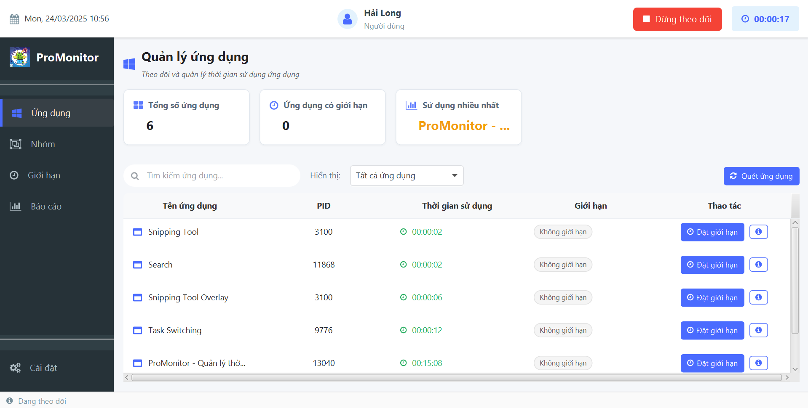
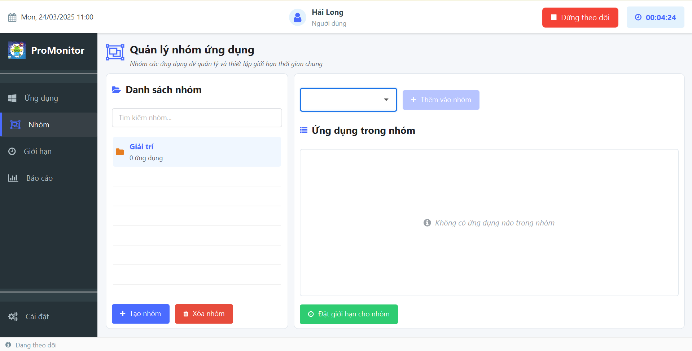
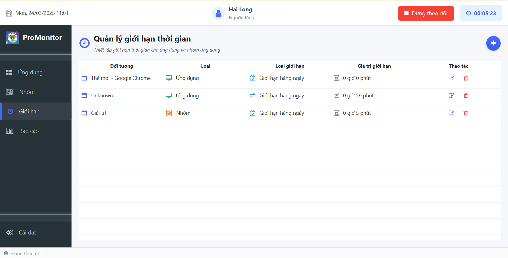
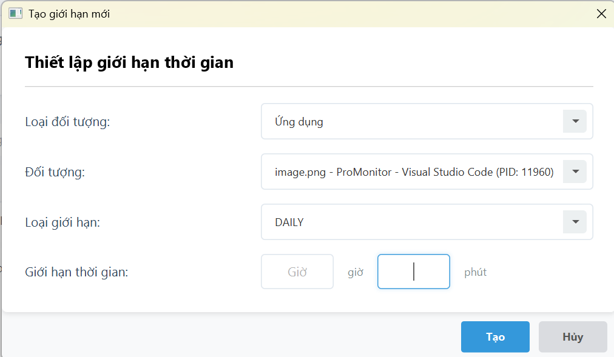
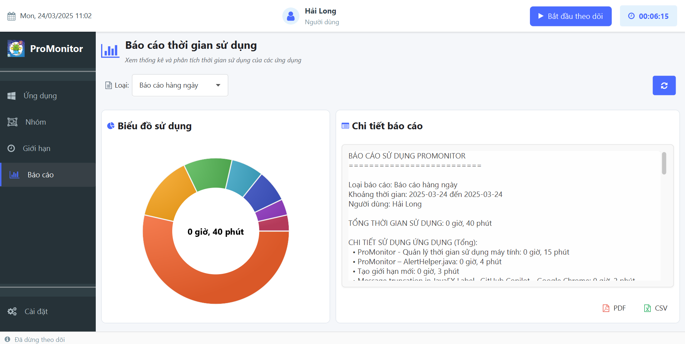
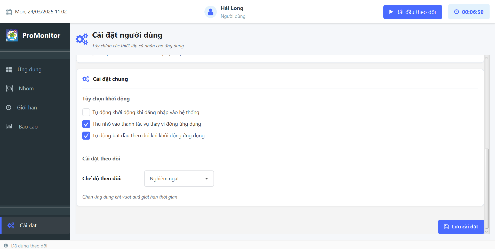

# ProMonitor
ProMonitor là một công cụ giám sát ứng dụng thông minh được thiết kế để giúp người dùng theo dõi và quản lý thời gian sử dụng máy tính của họ. Phần mềm cho phép bạn theo dõi các ứng dụng đang hoạt động, thiết lập giới hạn thời gian cho từng ứng dụng hoặc nhóm ứng dụng, và nhận thông báo khi vượt quá giới hạn thời gian.

## Tác giả

[Hải Long](https://github.com/team3hailong)

## Demo

[[ProJApp] ProMonitor](https://youtu.be/9e4TuZeYuXA)

## Ảnh chụp màn hình








## Tính năng

- **Giám sát ứng dụng thời gian thực:** Theo dõi ứng dụng nào đang hoạt động và thời gian sử dụng
- **Giới hạn thời gian sử dụng:** Đặt giới hạn thời gian hàng ngày hoặc hàng tuần cho các ứng dụng cụ thể hoặc nhóm ứng dụng
- **Nhiều loại thông báo:** Lựa chọn từ các tùy chọn thông báo khác nhau khi vượt quá giới hạn
- **Giám sát chế độ nghiêm ngặt hoặc thoải mái:** Chọn giữa chế độ nghiêm ngặt (tự động đóng ứng dụng khi vượt quá giới hạn) hoặc chế độ thoải mái (chỉ thông báo)
- **Báo cáo toàn diện:** Tạo báo cáo sử dụng chi tiết theo ngày, tuần, hoặc khoảng thời gian tùy chỉnh
- **Tích hợp vào khay hệ thống:** Thu nhỏ ứng dụng vào khay hệ thống để giám sát kín đáo
- **Khởi động tự động:** Tùy chọn để tự động bắt đầu giám sát khi ứng dụng khởi động
- **Giao diện thân thiện với người dùng:** Giao diện trực quan và dễ sử dụng cho tất cả các chức năng
- **Nhóm ứng dụng:** Tạo các nhóm ứng dụng tùy chỉnh để giám sát tập thể

## Yêu cầu hệ thống

- Java 11 trở lên
- JavaFX 11 trở lên
- Maven 3.6.3 trở lên
- Hệ điều hành Windows (cho chức năng theo dõi ứng dụng)
- Tối thiểu 4GB RAM
- 100MB dung lượng ổ đĩa trống

## Cài đặt

### Từ mã nguồn
```bash
# Sao chép kho lưu trữ
git clone https://github.com/YourUsername/ProMonitor.git

# Di chuyển đến thư mục dự án
cd ProMonitor

# Xây dựng dự án
mvn clean install

# Chạy ứng dụng
java -jar target/ProMonitor.jar
```

### Từ bản phát hành
```bash
# Tải xuống bản phát hành mới nhất từ
https://github.com/YourUsername/ProMonitor/releases/latest

# Chạy tệp JAR
java -jar ProMonitor.jar
```

## Cách sử dụng

1. Khởi chạy ứng dụng ProMonitor
2. Cấu hình tùy chọn thông báo trong phần Cài đặt
3. Tạo nhóm ứng dụng (tùy chọn)
4. Đặt giới hạn thời gian cho các ứng dụng hoặc nhóm ứng dụng cụ thể
5. Bắt đầu giám sát bằng cách nhấp vào nút "Bắt đầu giám sát"
6. Xem thống kê thời gian thực về việc sử dụng ứng dụng của bạn
7. Tạo báo cáo để phân tích các mẫu sử dụng máy tính của bạn

## Giấy phép

[MIT](https://choosealicense.com/licenses/mit/)
