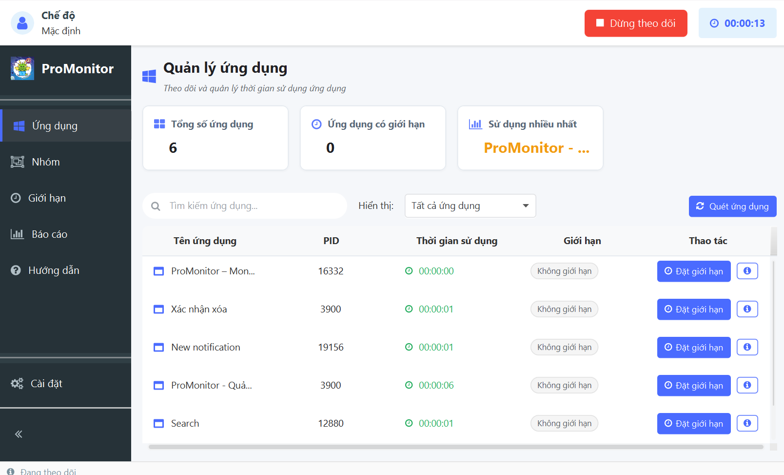
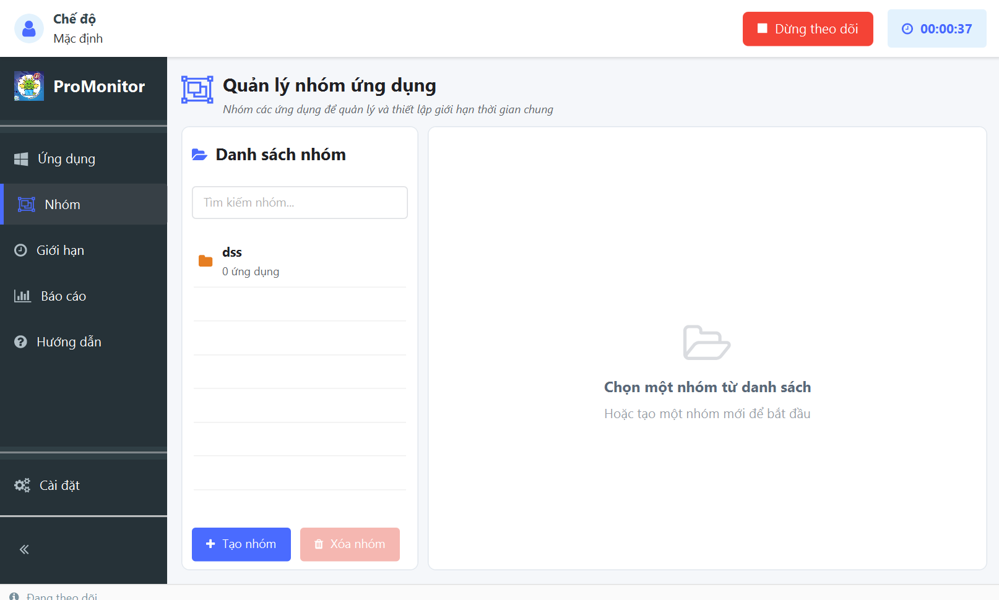
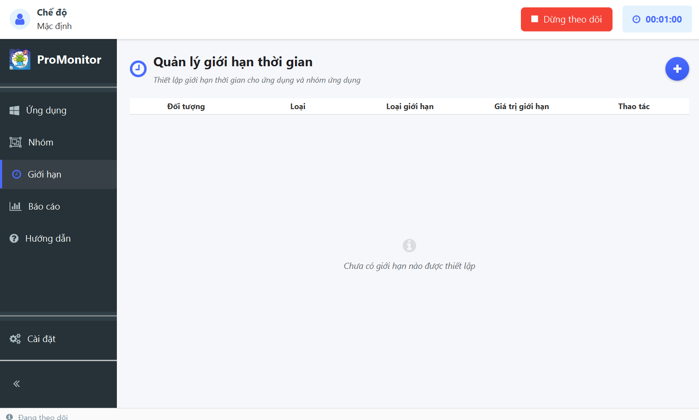
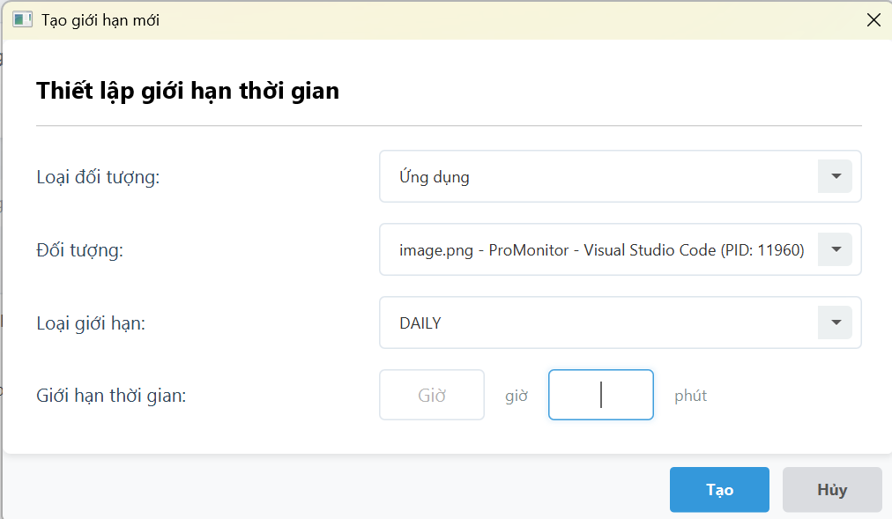
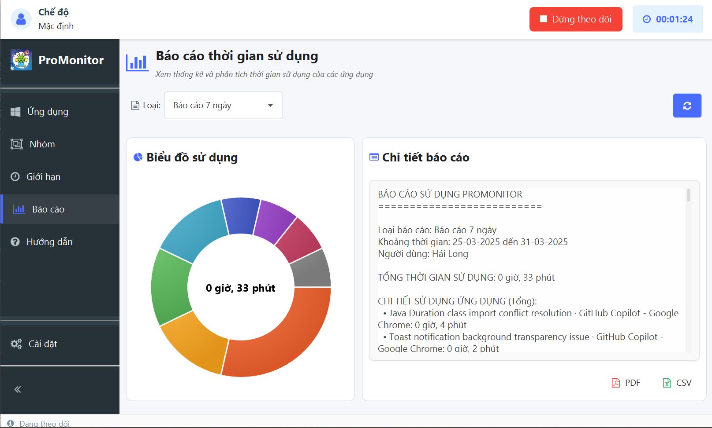
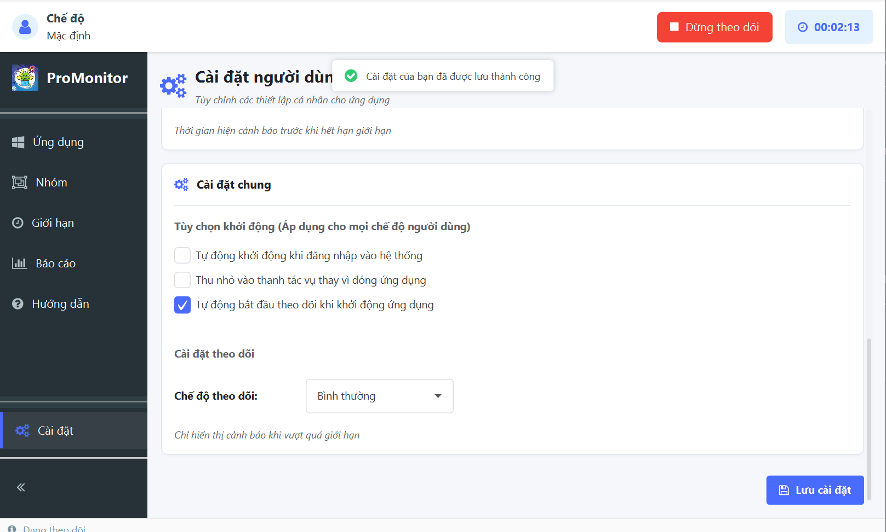

# ProMonitor

ProMonitor là công cụ giám sát ứng dụng thông minh giúp người dùng theo dõi và quản lý thời gian sử dụng máy tính. Phiên bản cập nhật này bổ sung các tính năng nâng cao như cấu hình tùy chỉnh theo user mode, báo cáo sử dụng chi tiết và quản lý nhóm ứng dụng.

## Tác giả

[Hải Long](https://github.com/team3hailong)

## Demo

[[ProJApp] ProMonitor](https://www.youtube.com/watch?v=U4WawoSM-xM)

## Ảnh chụp màn hình

  
  
  
  
  


## Tính năng

- **Giám sát ứng dụng theo thời gian thực:** Theo dõi ứng dụng đang hoạt động và tổng thời gian sử dụng.
- **Giới hạn thời gian sử dụng:** Đặt giới hạn cá nhân cho từng ứng dụng và nhóm ứng dụng.
- **Cấu hình theo User Mode:** Áp dụng cài đặt riêng biệt cho từng chế độ (Default, Work, Children) với các thông số như cảnh báo, giới hạn thời gian và chế độ giám sát (NORMAL/STRICT).
- **Báo cáo sử dụng tùy chỉnh nâng cao:** Tạo báo cáo dựa trên ngày, tuần, tháng và khoảng thời gian cụ thể.
- **Quản lý nhóm ứng dụng:** Tạo, chỉnh sửa và xóa nhóm ứng dụng để theo dõi tập thể.
- **Tích hợp tray system và tự động khởi động:** Hỗ trợ ẩn về tray hệ thống và tự động khởi động khi cài đặt.
- **Thông báo đa dạng:** Hỗ trợ nhiều loại thông báo (Popup, Audio,...) khi vượt quá giới hạn do cài đặt.
- **Lưu và đồng bộ cấu hình:** Dữ liệu cấu hình được lưu tự động theo định kỳ và áp dụng cho người dùng.

## Yêu cầu hệ thống

- Java 11 trở lên
- JavaFX 11 trở lên
- Maven 3.6.3 trở lên
- Hệ điều hành Windows (với chức năng giám sát ứng dụng)
- Tối thiểu 4GB RAM
- 100MB dung lượng ổ đĩa trống

## Cài đặt

### Từ mã nguồn
```bash
# Sao chép kho lưu trữ
git clone https://github.com/team3hailong/ProMonitor.git

# Di chuyển đến thư mục dự án
cd ProMonitor

# Xây dựng dự án
mvn clean install

# Chạy ứng dụng
java -jar target/ProMonitor.jar
```

### Từ bản phát hành
```bash
# Tải xuống bản phát hành mới nhất từ
https://github.com/team3hailong/ProMonitor/releases/latest

# Chạy tệp JAR
java -jar ProMonitor.jar
```

## Cách sử dụng

1. Khởi chạy ứng dụng ProMonitor.
2. Vào mục Cài đặt để cấu hình thông báo, giới hạn thời gian và thiết lập chế độ người dùng (User Mode).
3. Tạo nhóm ứng dụng (nếu cần) và đặt các giới hạn thời gian cụ thể.
4. Bắt đầu giám sát bằng cách nhấn nút "Bắt đầu giám sát".
5. Quan sát thời gian sử dụng ứng dụng theo thời gian thực trên giao diện chính.
6. Tạo báo cáo sử dụng để phân tích chi tiết theo ngày, tuần, tháng hoặc khoảng thời gian tùy chỉnh.
7. Ứng dụng tự động lưu cấu hình và dữ liệu giám sát, đồng thời hỗ trợ ẩn về tray hệ thống khi đóng giao diện.

## Giấy phép

[MIT](https://choosealicense.com/licenses/mit/)
